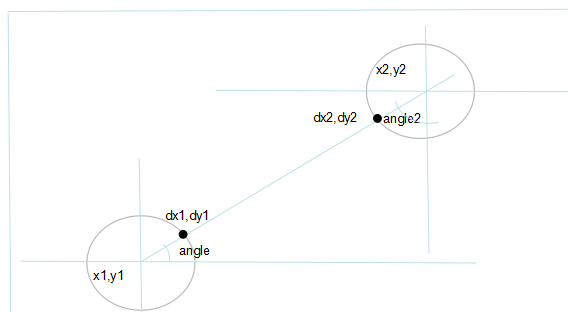

最近项目新增一个图表数据查看的。

效果图如下

各个折线点x,y点坐标很好计算。不好画的是如何让这个折线不穿过这个空心圆

如果折线穿过空心圆，则变成下面这个样子

折线点画圆没错，但是直接连接折线点肯定和圆有相交，但是这又是个空心圆，如果是实心圆，则先画线，再画圆就可以直接覆盖在上面。but 。。产品就是这么虐心，搞个空心圆。。so。实现起来难度就大那么一丢丢了。

既然不能直接连接圆中心，那就是需计算连接圆的那个点。

现把两个圆心坐标(x1,y1),(x2,y2),两个中心点连接的线和圆1交点（dx1,dy1）,和圆2的交点(dx2,dy2).显然。我们不能直接连接(x1,y1)到(x2,y2).否则就是上面图的效果。

我们要连接的就是(dx1,dy1)和(dx2,dy2).这样不会画到圆里面，并且和圆相连。

要计算dx1,dy1,dx2,dy2.则需要利用三角函数。

如上图。要计算dx1,dy1,我们已经知道圆的半径r，如果再知道角度angle。 
则  

	dx1 = r*cos(angle)+x1;
	dy1 = y1-r*sin(angle) ;

现在的问题就变成如何计算angle角度了？

我们利用圆1和圆2的中心点的组成的直角三角形，则可以计算angle的正切值，  

	tan(angle)=(y1-y2)/(x2-x1);
  
因此角度 

	angle=atan((y1-y2)/(x2-x1));

同样的dx2,和dy2也相应的  

	dx2 = (x2 - radius * Math.sin(angle2))  
	dy2 = (y2 + radius * Math.cos(angle2))  

角度angle2的正切值 

	tan(angle2) = (x2-x1)/(y1-y2);  
	angle2 =  atan(x2-x1)/(y1-y2); 

有同学就说了，angle2不就是90-angle吗？，计算出angle，angle2不就相当于已经计算出来了。
这里就不得不提Math里面的那些关于三角函数的方法了。 </b> 

我们直接打印  
System.out.println(Math.sin(30))  

输出  
-0.9880316240928618

咦？我们记得初中时三角函数sin30=0.5.这里的-0.988xxxxx是个什么东东  
莫急，我们再看  

我们再打印  
System.out.println(Math.sin(Math.toRadians(30)))  
输出  
0.49999999999999994  
好像和0.5已经很接近了。因为这里计算的都是double类型。而double类型计算会丢失精度，  
so 0.5就变成了0.49999999999  
这就说明Math方法里面的三角函数传入的不是我们所认为的角度，而是弧度，同样的，反切函数计算出来的也不是角度，而是弧度。  
如果上面我们利用90-angle.则我们还要把计算出来的angle转换为角度，然后再把90-角度，计算的时候还要转换为弧度。比如上计算angle2计算步骤更多。

   				//这里计算出来的是弧度
                double angle = Math.atan((y1-ly2)/(x2-lx1));

                float dx1 = (float) (x1 + radius*Math.cos(angle));
                float dy1 = (float) (y1 - radius*Math.sin(angle));
                double angle2 = Math.atan((x2-x1)/(y1-y2));
                float dx2=0,dy2=0;
                dx2 = (float) (x2 - radius * Math.sin(angle2));
                dy2 = (float) (y2 + radius * Math.cos(angle2));

至此。我们dx1,dx2,dy1,dy2全部都计算出来了，只要连接就可以。效果图如下

后一个圆在前一个圆上方的好像已经
完美连接了，在下方的还是会穿过圆。需区分开来

   				if (y1>y2) {
                     dx2 = (float) (x2 - radius * Math.sin(angle2));
                     dy2 = (float) (y2 + radius * Math.cos(angle2));
                }else{
                    dx2 = (float) (x2 + radius * Math.sin(angle2));
                    dy2 = (float) (y2 - radius * Math.cos(angle2));
                }

效果图如下  再调整下线颜色和宽度。就差不多了。

