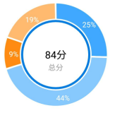
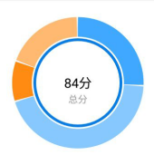
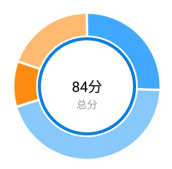
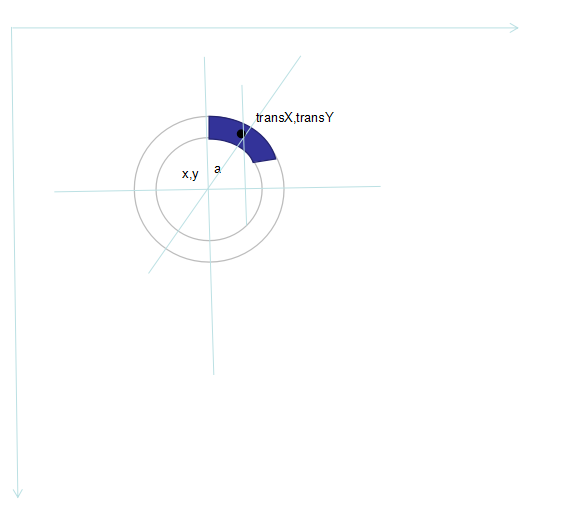
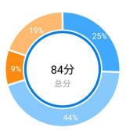

最近项目新增一个环形图表数据查看的。

效果图如下

在网上找了相关画环形的，都不符合需求，找到一个类似的代码RoundRateView，基本画出了外面圆环，但是有瑕疵，然后再修改    

首先根据传入的4个数值，计算出所占比例和相应的角度。然后画弧形 angleList是各个数据对应的角度。当然白色区域也算，所以加起来这个集合的大小就是8。

		float angle=0;
        for (int i = 0; i < angleList.size(); i++) {
            mPaint.setColor(colorList.get(i));
            if (i > 0) {
                startAngle += angleList.get(i - 1);
            }
            canvas.drawArc(oval, startAngle, angleList.get(i), false, mPaint);

        }
效果图如下  

可以看到中间隔层的白色离中心点越远，越宽。这不难理解，因为我们画的是个扇形。  
如何让中间隔层宽度一样呢。  
我这里是直接在中间隔层画了个白色的矩形，矩形肯定是宽度一样的，盖在上面就可以。这里还发生一个奇怪的问题，for循环里面注释的代码和后面for循环的代码一样，但是在画弧的for循环里面，还是没效果！！！单独for写在外面,如下代码，才有效果。此问题还不知啥原因。  
代码如下，首先保持图层，然后在中心点旋转相应的角度，再画白色的矩形
		
	 float angle=0;
	 for (int i = 0; i < angleList.size(); i++) {
            mPaint.setColor(colorList.get(i));
            if (i > 0) {
                startAngle += angleList.get(i - 1);
            }
            canvas.drawArc(oval, startAngle, angleList.get(i), false, mPaint);
	//			 angle+=angleList.get(i);
	//            if (angleList.get(i)>1){
	//                LogUtil.d("angle:"+angle+","+angleList.get(i));
	//                //画白色分隔带
	//                canvas.save();
	//                rectPaint.setColor(Color.WHITE);
	//                canvas.rotate(angle, getWidth() / 2, getHeight() / 2);
	//                RectF r = new RectF(getWidth() / 2, 0, getWidth() / 2 + ScreenUtil.dip2px(3), mCircleWidth+ScreenUtil.dip2px(4));
	//                canvas.drawRect(r, rectPaint);
	//                canvas.restore();
	//            }
        }

        for (int i=0;i<angleList.size();i++){
			 angle+=angleList.get(i);
            if (angleList.get(i)>1){
                LogUtil.d("angle:"+angle+","+angleList.get(i));
                //画白色分隔带
                canvas.save();
                rectPaint.setColor(Color.WHITE);
                canvas.rotate(angle, getWidth() / 2, getHeight() / 2);
                RectF r = new RectF(getWidth() / 2, 0, getWidth() / 2 + ScreenUtil.dip2px(3), mCircleWidth+ScreenUtil.dip2px(4));
                canvas.drawRect(r, rectPaint);
                canvas.restore();
            }
        }

效果如下。白色宽度保持一致了。  

剩下来就是画比例文字了。
	

只要我们把中心点平移到黑点。则就可以直接drawText画文字了。
代码如下。首先我们坐标移动到圆中心点。角度a就是弧形角度的一半。外边圆的半径，减去弧宽度的一半，就是黑点到圆中心点的距离。然后再乘以角度a的正弦 就是transX.也就是黑点的x坐标，同理可得黑点的y坐标。再根据字体的宽高调整下位置。就可以画在黑点的位置。代码如下

 	float preAngle=0;
        for (int i=0;i<angleList.size();i++){
            if (i>0) {
                preAngle += angleList.get(i - 1);
            }
            if (angleList.get(i)>1){
                //画比例数据
                canvas.save();
                //先平移到中心点
                canvas.translate(getWidth()/2,getHeight()/2);
                //将角度转换为弧度
                double a=Math.PI/180*(preAngle+angleList.get(i)/2);

                String data=(angleList.get(i)*100/360)+"%";

                float transX = (float) ((getWidth()/2 - mCircleWidth/2)*Math.sin(a))+ViewUtil.getTextRectWidth(textPaint,data)/2;
                float transY = (float) ((getWidth()/2 - mCircleWidth/2)*Math.cos(a))-ViewUtil.getTextHeight(textPaint);

                LogUtil.d("transX:"+transX+",transY:"+transY+","+String.valueOf(data));
                canvas.translate(transX,-transY);
                canvas.drawText(String.valueOf(data),0,0,textRatePaint);
                canvas.restore();
            }
        }

效果图如下。

完整代码如下

	public class RoundRateView extends View {
	    private Paint mPaint;
	    private int mCircleWidth; //圆环宽度
	    private int intervalAngle = 4;//间隔角度
	    private int intervalColor = Color.GRAY;//间隔颜色 默认灰色
	    private int aboveTextColor = Color.GRAY;//上面的文字 默认灰色
	    private int belowTextColor = Color.GRAY;//下面的文字 默认灰色
	    private int aboveTextSize = 60;//上面的文字字体大小
	    private int belowTextSize = 40;//下面的文字字体大小
	    private boolean isShowText = true; //是否显示中间文字 默认显示
	    /**
	     * 画文字的画笔
	     */
	    private Paint textPaint;
	    private Paint textRatePaint;
	
	    private int colors[] = {Color.parseColor("#41A8FF")
	            , Color.parseColor("#86C8FF")
	            , Color.parseColor("#FF8B13")
	            , Color.parseColor("#FFB971")
	            , Color.parseColor("#FF8A77")
	            , Color.parseColor("#EEE685")
	            , Color.parseColor("#EECBAD")
	            , Color.parseColor("#EEAEEE")
	            , Color.parseColor("#EE3B3B")
	            , Color.parseColor("#EDEDED")};
	
	
	    private List<Integer> angleList = new ArrayList<>(); //所有的角度 集合
	    private List<Integer> colorList = new ArrayList<>(); //所有的色值 集合
	    private List<Integer> dataList=new ArrayList<>();
	    private RectF oval;
	    private double allMoney;
	    private boolean isShowMoney = true; //是否是明文显示钱数,默认是明文显示
	    //    private Paint p;
	
	    public RoundRateView(Context context) {
	        super(context);
	        init(context, null, 0);
	    }

    public RoundRateView(Context context, @Nullable AttributeSet attrs) {
        super(context, attrs);
        init(context, attrs, 0);
    }

    public RoundRateView(Context context, @Nullable AttributeSet attrs, int defStyleAttr) {
        super(context, attrs, defStyleAttr);
        init(context, attrs, defStyleAttr);
    }

    private void init(Context context, AttributeSet attrs, int defStyleAttr) {

        TypedArray array = context.getTheme().obtainStyledAttributes(attrs, R.styleable.RoundRateView, defStyleAttr, 0);
        int n = array.getIndexCount();//自定义属性个数
        for (int i = 0; i < n; i++) {
            int attr = array.getIndex(i);//通过索引获取具体属性
            switch (attr) {
                case R.styleable.RoundRateView_rrv_circleWidth:
                    mCircleWidth = array.getDimensionPixelSize(attr, (int) dip2px(20f));
                    if (mCircleWidth < 2) {
                        mCircleWidth = 2;//最小宽度是2
                    }
                    break;
                case R.styleable.RoundRateView_rrv_intervalAngle:
                    intervalAngle = array.getDimensionPixelSize(attr, (int) dip2px(4f));
                    break;
                case R.styleable.RoundRateView_rrv_aboveTextSize:
                    aboveTextSize = array.getDimensionPixelSize(attr, (int) dip2px(60));
                    break;
                case R.styleable.RoundRateView_rrv_belowTextSize:
                    belowTextSize = array.getDimensionPixelSize(attr, (int) dip2px(40));
                    break;
                case R.styleable.RoundRateView_rrv_intervalColor:
                    intervalColor = array.getColor(attr, Color.GRAY);
                    break;
                case R.styleable.RoundRateView_rrv_aboveTextColor:
                    aboveTextColor = array.getColor(attr, Color.GRAY);
                    break;
                case R.styleable.RoundRateView_rrv_belowTextColor:
                    belowTextColor = array.getColor(attr, Color.GRAY);
                    break;
                case R.styleable.RoundRateView_rrv_isShowText:
                    isShowText = array.getBoolean(attr, true);
                    break;
            }
        }
        array.recycle();//定义完后属性对象回

        mPaint = new Paint();  //创建画笔
        mPaint.setAntiAlias(true);  //设置绘制时抗锯齿
        mPaint.setStyle(Paint.Style.STROKE); //设置绘画空心（比如画圆时画的是空心圆而不是实心圆）
        mPaint.setStrokeWidth(mCircleWidth);//设置画笔线宽

        textPaint = new Paint();
        textPaint.setAntiAlias(true);
        textPaint.setDither(true);
        textRatePaint = new Paint();
        textRatePaint.setAntiAlias(true);
        textRatePaint.setDither(true);
        textRatePaint.setTextSize(getResources().getDimension(R.dimen.s20));
        textRatePaint.setColor(Color.WHITE);
        textRatePaint.setTextAlign(Paint.Align.CENTER);
        rectPaint.setAntiAlias(true);
        rectPaint.setStyle(Paint.Style.FILL);
        rectPaint.setColor(Color.WHITE);
        rectPaint.setStrokeWidth(intervalAngle);
    }
    private Paint rectPaint = new Paint();
   
    public void setList(List<Integer> list) {
        int allIntervalAngle = 0;//所有间隔加起来的角度
        int allModuleAngle;  //所有模块加起来的角度  allModuleAngle + allIntervalAngle=360;
        if (list.size() > colors.length) {
            return;
        }
        angleList.clear();
        colorList.clear();
        allMoney = 0d;
        for (int i = 0; i < list.size(); i++) {
            allMoney += (list.get(i));
        }
        if (list.size() == 1) { //如果只有一条数据,就不要间隔
            angleList.add(360);
            colorList.add(colors[0]);
        } else {
            for (int i = 0; i < list.size(); i++) {
                if (list.get(i) != 0) {
                    allIntervalAngle += intervalAngle;
                }
            }
            if (allIntervalAngle == intervalAngle) {//如果只有一条数据不为0,就不要间隔颜色
                angleList.add(360);
                colorList.add(colors[0]);
            } else {
                allModuleAngle = 360 - allIntervalAngle;
                int angle = 0;
                for (int i = 0; i < list.size(); i++) {
                    if (list.get(i) != 0) {
                        int e = (int) (list.get(i) / allMoney * allModuleAngle);
                        dataList.add((int) (list.get(i) / allMoney)*100);
                        if (i == list.size() - 1) {//如果是最后一个色块,所占角度就是剩余全部的角度
                            this.angleList.add(allModuleAngle - angle);
                        } else {
                            angle += e;
                            this.angleList.add(e);
                        }
                        this.angleList.add(intervalAngle);
                        this.colorList.add(colors[i]);
                        this.colorList.add(intervalColor);
                    }

                }
            }

        }

        invalidate();
    }

    @Override
    protected void onMeasure(int widthMeasureSpec, int heightMeasureSpec) {
        super.onMeasure(widthMeasureSpec, heightMeasureSpec);

        int widthPixels = this.getResources().getDisplayMetrics().widthPixels;//获取屏幕宽
        int heightPixels = this.getResources().getDisplayMetrics().heightPixels;//获取屏幕高
        int width = MeasureSpec.getSize(widthMeasureSpec);
        int hedight = MeasureSpec.getSize(heightMeasureSpec);
        int minWidth = Math.min(widthPixels, width);
        int minHedight = Math.min(heightPixels, hedight);
        setMeasuredDimension(Math.min(minWidth, minHedight), Math.min(minWidth, minHedight));

    }

    public void setIsShowText(boolean isShowText) {
        this.isShowText = isShowText;
        invalidate();
    }

    @Override
    protected void onDraw(Canvas canvas) {
        super.onDraw(canvas);
        drawCircle(canvas);
        if (isShowText) {
            drawText(canvas);
        }
        drawInnerCicle(canvas);
    }

    private void drawInnerCicle(Canvas canvas) {

        mPaint.setStrokeWidth(ScreenUtil.dip2px(4));
        mPaint.setColor(getResources().getColor(R.color.time_axis_detail_sleep_title));
        int radiu = (int) (getMeasuredWidth()/2 - mCircleWidth - dip2px(4));

        canvas.drawCircle(getMeasuredWidth()/2,getHeight()/2,radiu,mPaint);
    }

    /**
     * 画出圆弧
     *
     * @param canvas
     */
    private void drawCircle(Canvas canvas) {
        if (oval == null) {
            int min = Math.min(getWidth() - mCircleWidth / 2, getHeight() - mCircleWidth / 2);
            oval = new RectF(mCircleWidth / 2, mCircleWidth / 2,
                    min, min);
        }
        float startAngle = -90f;

     
        mPaint.setColor(intervalColor);

        mPaint.setStrokeWidth(mCircleWidth);
        float angle=0;
        for (int i = 0; i < angleList.size(); i++) {
            mPaint.setColor(colorList.get(i));
            if (i > 0) {
                startAngle += angleList.get(i - 1);
            }
            canvas.drawArc(oval, startAngle, angleList.get(i), false, mPaint);
	//            angle+=angleList.get(i);
	//
	//            if (angleList.get(i)>1){
	//                LogUtil.d("angle:"+angle+","+angleList.get(i));
	//                //画白色分隔带
	//                canvas.save();
	//                rectPaint.setColor(Color.WHITE);
	//                canvas.rotate(angle, getWidth() / 2, getHeight() / 2);
	//                RectF r = new RectF(getWidth() / 2, 0, getWidth() / 2 + ScreenUtil.dip2px(3), mCircleWidth+ScreenUtil.dip2px(4));
	//                canvas.drawRect(r, rectPaint);
	//                canvas.restore();
	//            }
        }

        for (int i=0;i<angleList.size();i++){
            angle+=angleList.get(i);
            if (angleList.get(i)>1){
                LogUtil.d("angle:"+angle+","+angleList.get(i));
                //画白色分隔带
                canvas.save();
                rectPaint.setColor(Color.WHITE);
                canvas.rotate(angle, getWidth() / 2, getHeight() / 2);
                RectF r = new RectF(getWidth() / 2, 0, getWidth() / 2 + ScreenUtil.dip2px(3), mCircleWidth+ScreenUtil.dip2px(4));
                canvas.drawRect(r, rectPaint);
                canvas.restore();
            }
        }
        float preAngle=0;
        for (int i=0;i<angleList.size();i++){
            if (i>0) {
                preAngle += angleList.get(i - 1);
            }
            if (angleList.get(i)>1){
                //画比例数据
                canvas.save();
                //先平移到中心点
                canvas.translate(getWidth()/2,getHeight()/2);
                //将角度转换为弧度
                double a=Math.PI/180*(preAngle+angleList.get(i)/2);

                String data=(angleList.get(i)*100/360)+"%";

                float transX = (float) ((getWidth()/2 - mCircleWidth/2)*Math.sin(a))+ViewUtil.getTextRectWidth(textPaint,data)/2;
                float transY = (float) ((getWidth()/2 - mCircleWidth/2)*Math.cos(a))-ViewUtil.getTextHeight(textPaint);

                LogUtil.d("transX:"+transX+",transY:"+transY+","+String.valueOf(data));
                canvas.translate(transX,-transY);
                canvas.drawText(String.valueOf(data),0,0,textRatePaint);
                canvas.restore();
            }
        }

    }

    public String precentStr;
    public String precentUnit;
    /**
     * 画出中间的文字
     *
     * @param canvas 画布对象
     */
    private void drawText(Canvas canvas) {
        int center = getWidth() / 2;
        String percent;
        percent=precentStr;
        textPaint.setTextSize(aboveTextSize);
        //防止文字边界超过内环边界  上面的文字大小减小 下面的文字大小也跟着减小
        while (textPaint.measureText(percent) > getWidth() - 2f * mCircleWidth) {
            aboveTextSize--;
            belowTextSize--;
            textPaint.setTextSize(aboveTextSize);
        }

        textPaint.setTextAlign(Paint.Align.CENTER); // 设置文字居中，文字的x坐标要注意
        textPaint.setColor(aboveTextColor); // 设置文字颜色
        textPaint.setStrokeWidth(0); // 注意此处一定要重新设置宽度为0,否则绘制的文字会重叠
        Rect bounds = new Rect(); // 文字边框
        textPaint.getTextBounds(percent, 0, percent.length(), bounds); // 获得绘制文字的边界矩形
        Paint.FontMetricsInt fontMetrics = textPaint.getFontMetricsInt(); // 获取绘制Text时的四条线
        int baseline = center + (fontMetrics.bottom - fontMetrics.top) / 2 - fontMetrics.bottom; // 计算文字的基线,方法见http://blog.csdn.net/harvic880925/article/details/50423762
        canvas.drawText(percent, center, baseline, textPaint); // 绘制文字
        percent=precentUnit;
        textPaint.setColor(belowTextColor); // 设置文字颜色
        textPaint.setTextSize(belowTextSize);
        //防止下面的文字超出内环边界
        while (textPaint.measureText(percent) > getWidth() - 2f * mCircleWidth) {
            belowTextSize--;
            textPaint.setTextSize(belowTextSize);
        }
        textPaint.getTextBounds(percent, 0, percent.length(), bounds); // 获得绘制文字的边界矩形
        Paint.FontMetricsInt fontMetrics1 = textPaint.getFontMetricsInt(); // 获取绘制Text时的四条线
        int baseline1 = center + (fontMetrics1.bottom - fontMetrics1.top) / 2 - fontMetrics.bottom + 38 * 2;
        canvas.drawText(percent, center, baseline1, textPaint); // 绘制文字
    }

    public static int px2dip(int pxValue) {
        final float scale = Resources.getSystem().getDisplayMetrics().density;
        return (int) (pxValue / scale + 0.5f);
    }

    public static float dip2px(float dipValue) {
        final float scale = Resources.getSystem().getDisplayMetrics().density;
        return (dipValue * scale + 0.5f);
    }

    public void setIsShowMoney(boolean isShowMoney) {
        this.isShowMoney = isShowMoney;
        invalidate();
    }
	}

